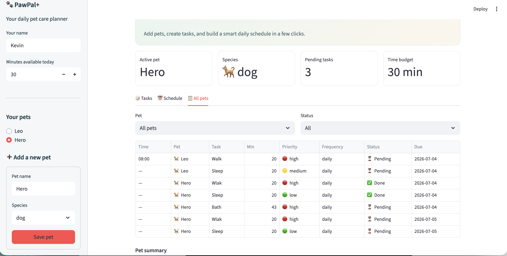

# PawPal+

**PawPal+** is a pet care planning assistant built with Python and Streamlit. It helps a busy owner manage multiple pets, prioritize care tasks, and generate a daily schedule that respects available time, task priority, and recurring due dates.

Backend logic lives in `pawpal_system.py`. The interactive demo runs through `app.py`. Terminal verification is available via `main.py`.

## Features

- **Multi-pet profiles** — An `Owner` can save multiple `Pet` records and switch between them in the UI.
- **Task management** — Add care tasks with description, duration, priority, and frequency (`daily`, `weekly`, `once`).
- **Priority-based scheduling** — `Scheduler.sort_tasks_by_priority()` ranks tasks before fitting them into the owner's time budget.
- **Sorting by time** — `Scheduler.sort_by_time()` and `sort_items_by_time()` display plans in chronological order using an `HH:MM` sort key.
- **Filtering** — `Scheduler.filter_tasks()` narrows tasks by pet name and/or completion status.
- **Daily and weekly recurrence** — `Pet.mark_task_complete()` creates the next task instance using `timedelta` (+1 day or +7 days).
- **Due-date planning** — `CareTask.is_due_for_planning()` excludes future recurring tasks from today's plan.
- **Conflict warnings** — `Scheduler.detect_conflicts()` flags overlapping scheduled tasks and returns readable warnings instead of crashing.
- **Plan explanations** — `Scheduler.explain_plan()` describes why each task was chosen and notes skipped tasks.
- **Automated tests** — `tests/test_pawpal.py` verifies sorting, recurrence, conflicts, and core task behavior.

## Getting Started

### Setup

```bash
python -m venv .venv
source .venv/bin/activate  # Windows: .venv\Scripts\activate
pip install -r requirements.txt
```

### Run the app

```bash
streamlit run app.py
```

### Run the CLI demo

```bash
python main.py
```

### Run tests

```bash
python -m pytest
```

## Architecture

System design is documented in:

- `diagrams/uml_final.mmd` — final class diagram matching `pawpal_system.py`
- `diagrams/uml_draft.mmd` — initial Phase 1 design

Core classes:

| Class | Responsibility |
|-------|----------------|
| `Owner` | Profile, time budget, pet list, cross-pet task access |
| `Pet` | One animal and its task list; completes tasks and triggers recurrence |
| `CareTask` | One care activity with priority, frequency, due date, and scheduled time |
| `Scheduler` | Sort, filter, plan, detect conflicts, and explain results |

## Smarter Scheduling

| Feature | Method(s) | Notes |
|---------|-----------|-------|
| Task sorting | `Scheduler.sort_by_time()`, `Scheduler.sort_items_by_time()`, `Scheduler.sort_tasks_by_priority()` | Priority first when building a plan; chronological order for display |
| Filtering | `Scheduler.filter_tasks()` | Filter by pet name and/or completion status |
| Conflict handling | `Scheduler.detect_conflicts()` | Detects overlapping time ranges; returns warnings |
| Recurring tasks | `CareTask.next_due_date()`, `CareTask.create_next_occurrence()`, `Pet.mark_task_complete()`, `CareTask.is_due_for_planning()` | Daily +1 day; weekly +7 days; once does not repeat |

## Demo Walkthrough

### App screenshot



*Screenshot: owner profile and pet selection in the sidebar; metrics, task tabs, and filtered task table in the main view.*

### Main UI features

The Streamlit app (`app.py`) connects directly to the backend classes stored in `st.session_state`:

1. **Sidebar — Owner Profile** — Set your name and available minutes for today.
2. **Sidebar — Your pets** — Select an active pet with radio buttons; add new pets in the bordered form below.
3. **Tasks tab** — Add tasks for the selected pet; filter pending/completed tasks; mark tasks complete to trigger recurrence.
4. **Schedule tab** — View the generated daily plan, skipped-task warnings, conflict alerts, and explanations.
5. **All pets tab** — Filter tasks across every pet by name and status; view a pet summary table.
6. **Generate today's plan** — Primary sidebar button builds a cross-pet schedule using the smart scheduler.

### Example workflow

1. Open the app and enter owner details (for example, **Kevin**, **30 minutes** available).
2. Add pets such as **Leo** and **Hero** (dog) using **Save pet** in the sidebar.
3. Select **Hero** in the sidebar and open the **Tasks** tab to add care activities.
4. Switch to **All pets** to review tasks across both pets with filters.
5. Mark a daily task complete and confirm a new recurring instance appears with a future due date.
6. Click **Generate today's plan** in the sidebar.
7. Open the **Schedule** tab to review the time-sorted plan, skipped-task warnings, and any conflict alerts.

### Scheduler behaviors shown in the UI

- **Sorting** — The schedule table uses `sort_items_by_time()` so tasks appear earliest to latest.
- **Priority fit** — Higher-priority pending tasks are scheduled first within the available minute budget.
- **Filtering** — Task lists and the overview section use `filter_tasks()` so owners can focus on one pet or pending work.
- **Recurrence** — Completing a daily task creates the next occurrence due tomorrow.
- **Conflict warnings** — If two tasks overlap, the UI shows an expanded warning panel with plain-language guidance.

### Sample CLI output

Running `python main.py` demonstrates the same backend logic in the terminal:

```
Recurring task created: 'Feed breakfast' due on 2026-07-05

Filter: pending tasks only
------------------------------------------------------------------------
  — | Mochi | Morning walk | pending | due 2026-07-04
  — | Mochi | Evening meds | pending | due 2026-07-04
  ...

PawPal+ | Today's Schedule
------------------------------------------------------------------------
Owner: Jordan
Time available today: 90 minutes

TIME     PET        TASK                     DURATION   PRIORITY
------------------------------------------------------------------------
08:00    Mochi      Evening meds             5 min     high
08:05    Mochi      Morning walk             30 min     high
08:35    Biscuit    Clean litter box         15 min     medium
08:50    Biscuit    Play session             20 min     low
------------------------------------------------------------------------
Summary: 4 task(s) scheduled · 70 min used · 20 min remaining

Conflict detection demo (two tasks scheduled at 09:00):
------------------------------------------------------------------------
Schedule warnings
------------------------------------------------------------------------
  Warning: 'Morning walk' for Mochi (09:00–09:30) overlaps with 'Feed breakfast' for Biscuit (09:00–09:15).
```

## Testing PawPal+

Run the automated test suite from the project root:

```bash
python -m pytest
```

### What the tests cover

The suite in `tests/test_pawpal.py` verifies:

- **Task lifecycle** — completing a task updates its status; adding a task increases a pet's task count
- **Sorting** — `Scheduler.sort_by_time()` returns tasks in chronological order; generated plans stay time-sorted
- **Recurrence** — completing a daily task creates a new task due the next day; weekly tasks recur in 7 days; one-time tasks do not repeat
- **Conflict detection** — `Scheduler.detect_conflicts()` flags duplicate/overlapping scheduled times with warning messages

### Sample test output

```
============================= test session starts ==============================
platform darwin -- Python 3.9.6, pytest-8.4.2, pluggy-1.6.0
rootdir: /Users/abhijeetcherungottil/Desktop/ai110-module2show-pawpal-starter
collected 8 items

tests/test_pawpal.py ........                                            [100%]

============================== 8 passed in 0.02s ===============================
```

### Confidence level

**★★★★☆ (4/5)** — Core scheduling, sorting, recurrence, and conflict detection are covered by passing tests and the CLI demo. Confidence would reach 5/5 with additional edge-case tests (empty pets, zero time budget, partial time overlaps, and UI integration tests).
